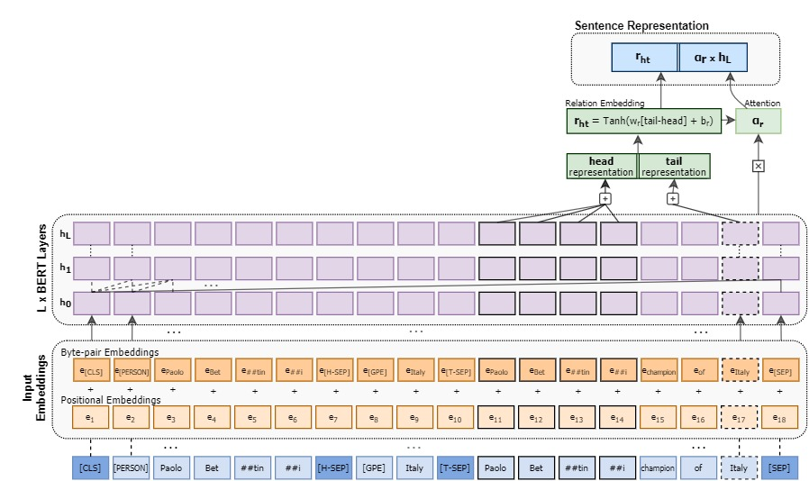
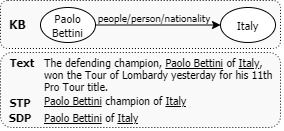

#  REDSandT: Improving Distantly-Supervised Relation Extraction through BERT-based Label & Instance Embedding


This repository contains the code of our paper:<br />
[Improving Distantly-Supervised Relation Extraction through BERT-based Label & Instance Embedding](https://ieeexplore.ieee.org/stamp/stamp.jsp?tp=&arnumber=9405641)<br />
Despina Christou and Grigorios Tsoumakas

<h5 align="center">
  
</h5>
<h5 align="center">
  REDSandT Overview
</h5>


> REDSandT (Relation Extraction with Distant Supervision and Transformers) is a novel distantly-supervised 
transformer-based RE method that manages to capture highly informative instance and label embeddings for RE by 
transferring common knowledge from the pre-trained BERT language model. Experiments in two widely used benchmark 
datasets NYT-10 and GDS show that REDSandT captures a broader set of relations with higher confidence, including 
relations in the long tail.


## Using Git Repository
Clone the repository from our github page and then create a virtual environment
```
conda create --name redsandt python=3.6
```
, activate this
```
conda activate redsandt
```

, and finally install the requirements:
```
pip install -r requirements.txt
```


### Datasets
We evaluate our model on the standard benchmark datasets for distantly supervised relation extraction: NYT-10 (_Riedel et al., 2010_) and GDS (*Jat et al., 201*8).

We enhance both datasets with extra information, including compressed forms of the original relational instances (STP, SDP) and generic entity types extracted through spaCy. 

<h8 align="left">
  Example of STP, SDP versions of texts:
</h8>
<h5 align="left">
  
</h5>

We present '**NYT-10-enhanced**' and '**GDS-enhanced**' datasets.

'NYT-10-enhanced' includes the following information:
- "text": Relational Instance (same as in NYT-10)
- "stp": Sub-Tree path - Connects an entity pair to their least common ancestor' s parent
- "sdp": Sub-Dependency path - Connects an entity pair to their least common ancestor
- "{h,t}_id": Head/Tail unique id (same as in NYT-10)
- "{h,t}_word": Head/Tail tokens (same as in NYT-10)
- "{h,t}_char_pos": Head/Tail char pos in "text" (same as in NYT-10)
- "{h,t}_token_pos": Head/Tail token pos in "text"
- "{h,t}_ne": Head/Tail entity types (captured with spaCy for each "text")
- "relation": Freebase Relation (same as in NYT-10)


'GDS-enhanced' includes the following information:
- "text": Relational Instance (same as in GDS)
- "stp": Sub-Tree path - Connects an entity pair to their least common ancestor' s parent
- "{h_FB,t_FB}_ID": Head/Tail Freebase unique id (same as in GDS)
- "{h,t}_word": Head/Tail tokens (same as in GDS)
- "{h,t}_ne": Head/Tail entity types (captured with spaCy for each "text")
- "relation": Relation (same as in GDS)
- "relation_id": Relation id

> To facilitate 
reproducibility of our results and encourage further research on relation extraction using compressed forms of 
instances and generic entity types, we provide both datasets' enhanced versions. These can be found [here](https://drive.google.com/file/d/1YF4Qvz8p3-tuZ-hJ4DXhl7Vhz-kepKKl/view?usp=sharing).
 <br/>
 Please unzip and place 'NYT-10-enhanced' and 'GDS-enhanced' folders under /benchmark.


## Training
Run the following command:
```
python redsandt.py --dataset <dataset> --config <path_to_config_file> --model_dir <model_dir> --model_name <model_name> --train --eval
```
- for NYT-10 dataset:
``
python redsandt.py --dataset "NYT-10" --config "experiments/configs/NYT-10/REDSandT/config.json" --model_dir "REDSandT" --model_name "redsandt" --train --eval
``

- for GDS dataset:
``
python redsandt.py --dataset "GDS" --config "experiments/configs/GDS/REDSandT/config.json" --model_dir "REDSandT" --model_name "redsandt_gids" --train --eval
``

## Evaluation:
> The models we trained on 'NYT-10-enhanced' and 'GDS-enhanced' can be found [here](https://drive.google.com/file/d/1qIcJMJaZ8Fku8lirQphCeGvbquhtIDnj/view?usp=sharing).
 <br/>
 Please unzip and place NYT-10 and GDS folders under /experiments/ckpt.

Run the following command:
```
python redsandt.py --dataset <dataset> --config <path_to_config_file> --model_dir <model_dir> --model_name <model_name> --eval
```
- for NYT-10 dataset:
``
python redsandt.py --dataset "NYT-10" --config "experiments/configs/NYT-10/REDSandT/config.json" --model_dir "REDSandT" --model_name "redsandt" --eval
``

- for GDS dataset:
``
python redsandt.py --dataset "GDS" --config "experiments/configs/GDS/REDSandT/config.json" --model_dir "REDSandT" --model_name "redsandt_gids"  --eval
``


## Baselines
We gathered in *"baselines_pr"* folder the precision - recall values for several state-of-the-art baselines for both 
NYT-10 and GDS. Download from [here](https://drive.google.com/file/d/1-0DWtLqDMT4xQcIR8fSHT16EOg1vhYA8/view?usp=sharing) and unzip to use.

## Citations
If you use our code in your research or find our repository useful, please consider citing our work.
```
@article{christou2021improving,
  author={Christou, Despina and Tsoumakas, Grigorios},  
  title={Improving Distantly-Supervised Relation Extraction Through BERT-Based Label and Instance Embeddings},
  journal={IEEE Access},  
  volume={9},    
  pages={62574-62582},  
  year={2021},
  publisher={IEEE}, 
  doi={10.1109/ACCESS.2021.3073428}}
```
